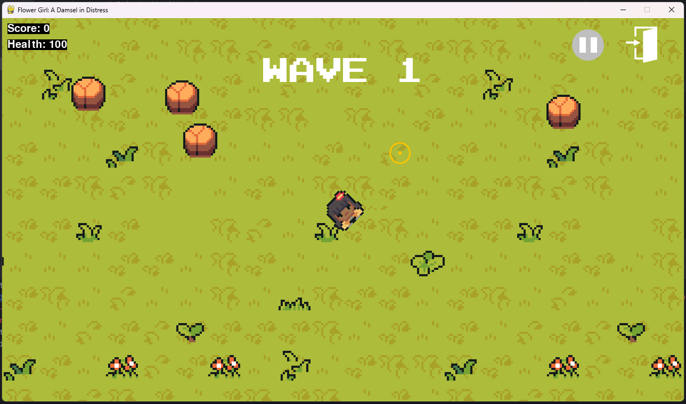
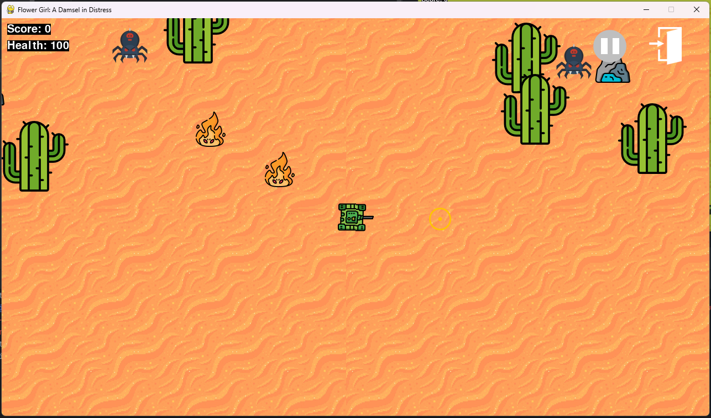

# Flower Girl Top Down Shooter Game
This is a tiny top down shooter video game starring our two characters: flower girl, and tank respectively in Level 1 and Level 2.  

  
  

## PLAY
- Play on itch.io
  - [Web](https://apunthegreat.itch.io/flower-girl)
  - [Phone](https://apunthegreat.itch.io/flower-girl-mobile)
- Download Desktop version
  - [download](https://github.com/shayaandanishansari/flowergirl/releases)

## INSTRUCTIONS

# *// For Developers //*

## DOWNLOAD AND RUN
- Requirements
  - install python and pygame native platform
- Clone the repo
  - git clone https://github.com/shayaandanishansari/file_structure_visualiser/ 
- Run
  - python -m venv .venv
  - Windows: .venv\Scripts\activate 
  - macOS/Linux: source .venv/bin/activate
  - pip install requirements.txt 
  - python Web/main.py
- Build
  - cd Web
  - pip install -r requirements.txt pygbag
  - python -m pygbag --build main.py

## __Credits__  

__Contributors__  
[Syed Abdurahman](https://github.com/Abdurrehman-A)  
[Umer Rahman](https://www.linkedin.com/in/umer-rahman-61835a250/)  

__Educators__  
Their educational content and tutorials served as key learning resources during the development of this project.  
[ClearCode](https://www.youtube.com/watch?v=QU1pPzEGrqw)  
[JCode](https://www.youtube.com/watch?v=paItMJuKwwM)  

__Assets__  
[JCode](https://github.com/JCode1029/top-down-shooter/tree/main/bullet)  
[Pixel-Boy](https://x.com/2Pblog1) and [AAA](https://www.instagram.com/challenger.aaa/?hl=fr): 
[Art Pack](https://pixel-boy.itch.io/ninja-adventure-asset-pack)  

__Technology__  
[Pygame](https://www.pygame.org/news)  
[pygbag](https://pypi.org/project/pygbag/)  
[itch.io](https://itch.io/)  

_and for everyone and everything that positively contributed directly or indirectly towards the success of Flower Girl_
